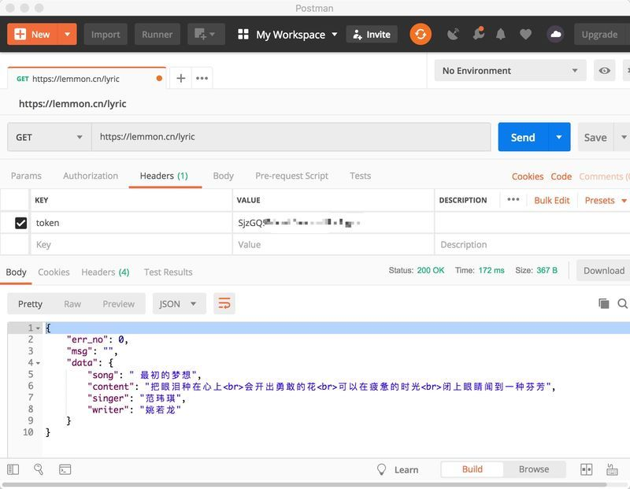

# Rolling - API

#### API介绍

[Rolling API](https://lemmon.cn)

很早就有想法做一个歌词推荐API，源于开发SPS（[Search to Play the Song](https://chrome.google.com/webstore/detail/search-to-play-the-song/anfmgjkkbagjfdejhbjdiapgkbhpigpm?hl=zh-CN)）的一个特色功能：歌曲不仅可以听来享受，有些也可以读来共鸣。然后就一点一点收集，开始了费力缺不怎么讨人喜的事情，但至少内心而言，觉得对音乐行业，对那些默默无闻的填词人做一些力所能及的贡献。

名字来源，Bob Dylon的`Like a Rolling Stone`。丑婆娘也有见公婆的一天，现在开始进入测试阶段，欢迎大家指点。

#### API返回

```
{
  "data": {
      "song": "或许",
      "content": "一个人要把肉身放在岁月的砧板上<br>煅打多少次他的心才能坚冷如钢<br>一个人要让泪水浸泡过多少次<br>那他的眼神才不会迷惘",
      "singer": "尹吾",
      "writer": "尹吾/舒婷"
  }
}
```

#### 接口使用

申请Token后即可食用，测试期间，每月限制不超过1000次访问



#### 收录和贡献

目前已经收录了我认为的经典，如李宗盛，姚谦，林夕，黄霑，黄伟文，姚若龙，方文山，李安修，李峻一，许冠杰，阿信，黄家驹，高晓松，陈小奇，宋冬野，毛不易，许巍，赵英俊，伍佰，GALA，逃跑计划，尹吾等等的一些词作。

如果你也觉得这个事情还不错，觉得自己喜欢的音乐还没有收录，那就一起贡献吧。

#### SPS

SPS虽然用户已经不少，不过还是希望能再做一次宣传，展示下这个小东西。

[Chrome商店地址](https://chrome.google.com/webstore/detail/search-to-play-the-song/anfmgjkkbagjfdejhbjdiapgkbhpigpm?hl=zh-CN)


